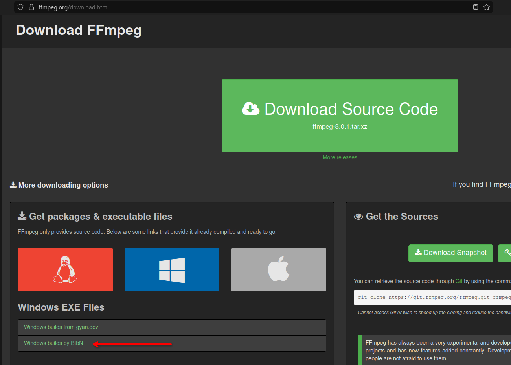
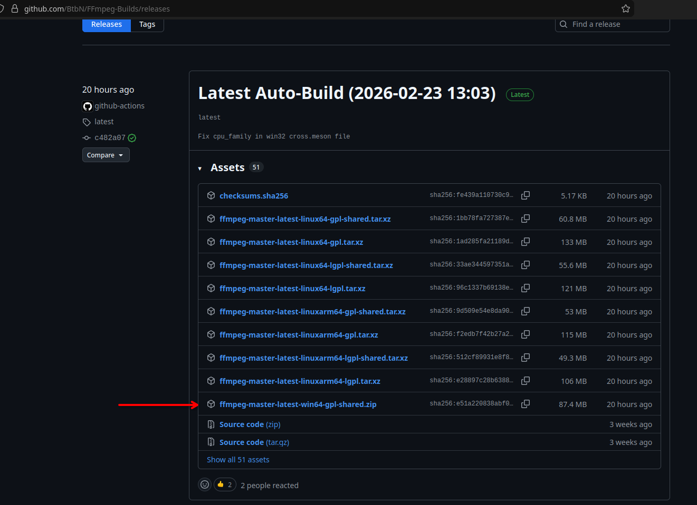
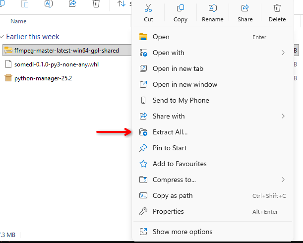
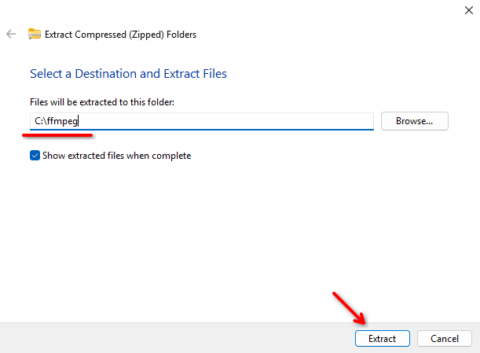
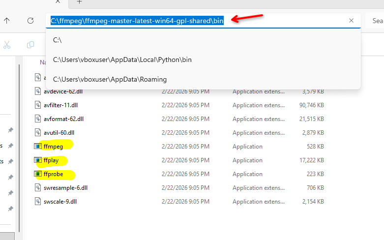
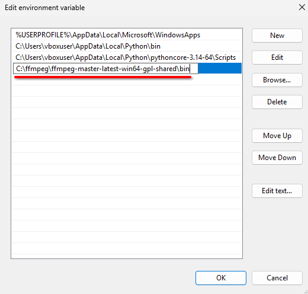

# Quick guide on how to install python on Linux
FFmpeg should be available on all linux distros via the package manager. Example:
### Arch Linux
```
pacman -S ffmpeg
```
### Debian, Ubuntu and all distros that use apt
```
sudo apt install ffmpeg
```
### Fedora
```
sudo dnf install ffmpeg
```
### OpenSuse
```
sudo zypper install ffmpeg
```


# Quick guide on how to install ffmpeg on Windows
You can either install ffmpeg via [winget](https://www.gyan.dev/ffmpeg/builds/), or follow this instruction for a manual install:


- Go to the ffmpeg website: https://ffmpeg.org/download.html
- Click on "Windows builds by BtbN".



- From github, download newest windows build.



- Extract the contents to a path of your liking, for example `C:\ffmpeg`.





- Go into the extracted folder and locate the `bin` folder.
- Copy the folder path



- Now you have to add this folder to path:
- Type "environment variables" in the search, open "Edit the system environment variables"


- In there, at the bottom click "Environment Variables..."


- Click on "Path" and then "Edit"


- Click "New" and then paste the path of the bin folder in there



- Click OK on all windows
- Reopen all CMD or PowerShell windows
