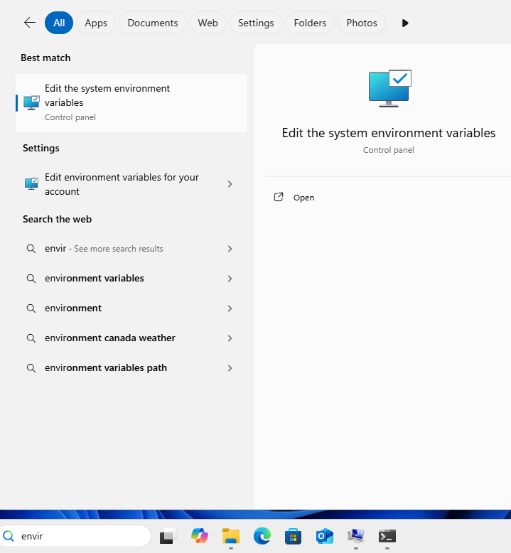
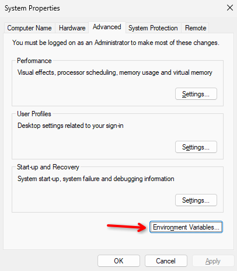
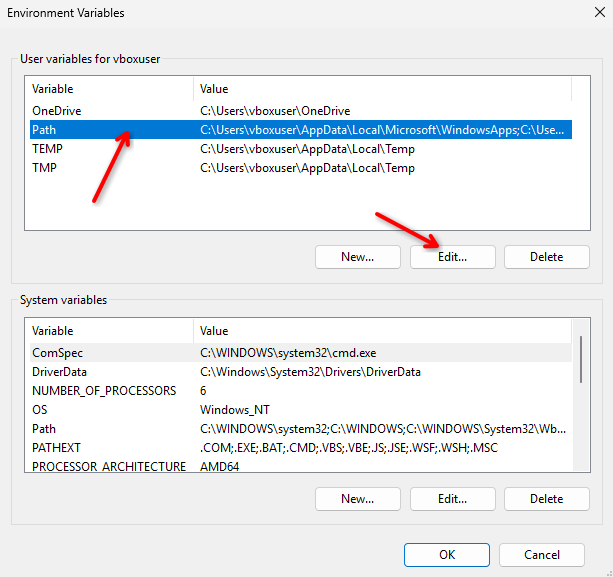

# General python installation on windows:
- Download the installer from the website
- Say yes to everything in the installer
- Install somedl via py -m pip install somedl

### If somedl command is not recognized, add the python scripts folder to path (This is not a somedl problem, this is a general python setup issue):
- The path is typically something like `C:\Users\YourName\AppData\Local\Programs\Python\pythoncore-3.14-64\Scripts` depending on your python version and mode of installation
- Type "environment variables" in the search, open "Edit the system environment variables"

- In there, at the bottom click "Environment Variables..."

- Click on "Path" and then "Edit"

- Click "New" and then paste the path of your scripts folder in there. It should look similar to this:

- Click OK on all windows
- Reopen all CMD or PowerShell windows
