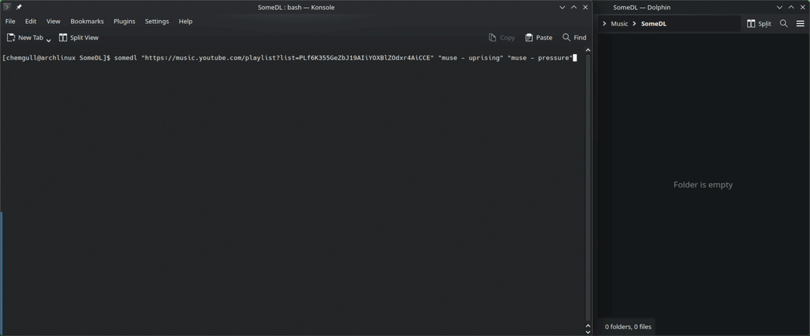

.. SomeDL documentation master file, created by
   sphinx-quickstart on Thu Jun  4 19:47:36 2026.
   You can adapt this file completely to your liking, but it should at least
   contain the root `toctree` directive.

SomeDL - Song+Metadata Downloader
=================================

SomeDL is an easy-to-use command-line tool for downloading music with accurate metadata. Simple installation and no login or API tokens required! Now also with a feature-rich WebUI. Free and open source forever, source code hosted on `GitHub <https://github.com/ChemistryGull/SomeDL>`_.

Command line interface (CLI):
-----------------------------

WebUI:
------

.. raw:: html

   <video controls width="100%">
      <source src="_static/SomeDL_WebUI_small.mp4" alt="SomeDL WebUI" type="video/mp4">
      Your browser does not support the video tag.
   </video>
    
    

.. tip::

   If you have any problems, feature requests, suggestions of improvements of any kind or even general questions, do not hesitate to open an issue or start an discussion here `GitHub <https://github.com/ChemistryGull/SomeDL>`_. I am open to add functionality based on individual usecases. See How can I give feedback or make feature requests?

.. admonition:: Disclaimer

   This project - although being fully functional - is primarily a way for me to learn the handling of APIs in python. This program is for educational purposes. SomeDL is developed on Linux and tested on Linux & Windows. This project is human-made, no code from generative AI is used.

The audio is downloaded using yt-dlp. SomeDL accepts text queries, YouTube URLs and YouTube playlist URLs. Metadata is fetched from YouTube, MusicBrainz, Genius and Deezer. Setlist data is fetched from setlist.fm. No API tokens required for any of these services, it works out of the box.

.. toctree::
   :maxdepth: 3
   :caption: Contents:

   installation/index
   usage/index
   features
   code_documentation/index